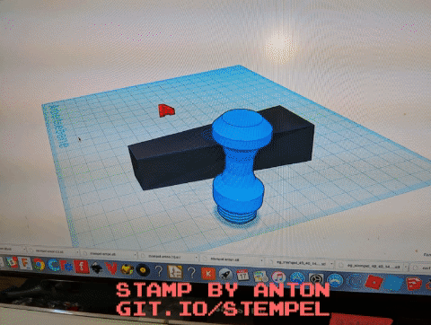

# erfinder-stamp

This a stemp designed in tinkercad and printed with a 3D printer and cut with a lasercutter at the open lab on 17.3.2018. 

Short link: [https://git.io/stempel](https://git.io/stempel)

## make one youself

You need a 3d printer or a lasercutter to make this stamp.

* stl file 
* [tinkercad link](https://www.tinkercad.com/things/8OM9B7f5Amr-stempel-anton/editv2?sharecode=yRd7hq-T_3WyIN5jCARA_ZOQ_PXWMZ6ZoOy7MRleqlk=)
* change the design in tinkercad
* 3D print the base and the handle
* rubber for lassercutter
* lasercutter

## How you can help?

* make a stamp yourself and send us the pictures
* make a parametric design
* make a version for only lasercutter

## Designer

Anton Stauber and his father

## Contact erfindergarden

Andreas Kopp

[andreas@erfindergarden.de](mailto:andreas@erfindergarden.de)

[www.erfindergarden.de](http://www.erfindergarden.de)

[www.facbebook.com/erfindergarden](http://www.facbebook.com/erfindergarden)

 
## License

This project is [Attribution-ShareAlike 2.5 Generic (CC BY-SA 2.5)](https://creativecommons.org/licenses/by-sa/2.5/). You can do anything what you want with it but please say that you got the original design from erfindergarden and als share it under the same license. 

For more information, see [license](license.md). 